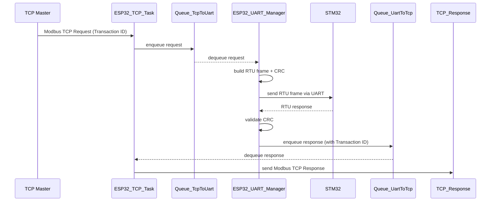

# ESP32 Modbus TCP–RTU Bridge Implementation (Revised & FreeRTOS-Integrated)

---

## 1. Tổng quan
Thiết kế hệ thống ESP32 đóng vai trò **Modbus TCP–RTU Bridge** theo chuẩn thiết bị công nghiệp. Phiên bản này đã được mở rộng và nâng cấp để:

- Quản lý các module bằng **FreeRTOS** (task, queue, event group, mutex)
- Tối ưu giao tiếp Modbus theo chuẩn 1.5T / 3.5T
- Bổ sung state machine, retry logic, UART scheduler
- Tăng độ ổn định trong môi trường công nghiệp
- Hỗ trợ cấu hình qua Modbus TCP/ Web/ NVS

---

## 2. Kiến trúc dữ liệu tổng thể
```
TCP Master → ESP32 (TCP Slave Task) → Queue → UART Manager Task → STM32 (RTU Master) → Slaves
                                                 ↓
TCP Master ← ESP32 ← Queue ← UART Manager Task ← STM32 ← Slaves
```

Các module hoạt động hoàn toàn độc lập và được điều phối bởi FreeRTOS.

---

## 3. Kiến trúc FreeRTOS

### 3.1 Danh sách Tasks

#### **Task 1: Modbus TCP Slave Task (task_modbus_tcp)**
- Nhận TCP request từ Modbus Master
- Parse header + Function Code + Transaction ID
- Đưa vào queue `xQueueTcpToUart`
- Không xử lý Modbus trong callback của lwIP

**Priority:** High

---

#### **Task 2: UART Manager Task (task_uart_manager)**
- Nhận request từ `xQueueTcpToUart`
- Tạo RTU frame + CRC16
- Gửi qua UART (Mutex bảo vệ UART)
- Chờ response theo chuẩn Modbus RTU
- Retry 1–3 lần nếu timeout/CRC lỗi
- Push response vào `xQueueUartToTcp`
- Trả Modbus Exception 0x0A / 0x0B nếu lỗi

**Priority:** Highest (Real-time)

---

#### **Task 3: WiFi Process Task (task_wifi_process)**
- Quản lý STA/AP mode
- Apply Static IP / DHCP
- Theo dõi Modbus registers
- Gửi status vào Input Registers

**Priority:** Medium

---

#### **Task 4: Config Manager Task (task_config_manager)**
- Nhận tín hiệu từ `xQueueEventToConfig`
- Lưu NVS / Apply config / Factory reset
- Reset WiFi hoặc UART khi cần

**Priority:** Low

---

#### **Task 5: System Monitor Task (task_system_monitor)**
- Kiểm tra trạng thái UART/WiFi
- Reset UART khi lỗi liên tục
- Ghi lỗi vào Input Registers
- Kick software watchdog

**Priority:** Low–Medium

---

### 3.2 Queue sử dụng

#### **Queue 1 – xQueueTcpToUart**
TCP → UART Manager

#### **Queue 2 – xQueueUartToTcp**
UART Manager → TCP

#### **Queue 3 – xQueueEventToConfig**
Module khác → Task Config Manager

---

### 3.3 Event Group
```
BIT0: WiFi Connected
BIT1: UART Stable
BIT2: Config Updated
BIT3: Factory Reset
BIT4: TCP Client Connected
```

---

### 3.4 Mutex
- **xMutexUart** – bảo vệ UART

---

## 4. Module Chi Tiết (Đã cập nhật theo FreeRTOS)

---

## Module 1: WiFi Static IP Configuration
### Directory: `components/wifi-process/`

#### Cấu trúc dữ liệu
```c
typedef struct {
    bool use_static_ip;
    esp_netif_ip_info_t ip_info;
    esp_ip4_addr_t dns_main;
    esp_ip4_addr_t dns_backup;
} wifi_static_ip_config_t;
```

#### Chức năng chính
- Load/Save IP từ NVS
- Apply Static IP hoặc DHCP
- Gửi sự kiện vào Modbus Registers
- Tạo event CONFIG_UPDATE khi người dùng ghi register cấu hình IP

---

## Module 2: UART Communication
### Directory: `components/uart-bridge/`

#### Cấu hình UART
```c
#define UART_PORT_NUM      UART_NUM_1
#define UART_TX_PIN        GPIO_NUM_17
#define UART_RX_PIN        GPIO_NUM_16
#define UART_BUF_SIZE      512
#define UART_TIMEOUT_MS    1000
```

#### Nâng cấp (so với bản cũ)
- Tích hợp Hardware Flow Control (nếu có)
- Sử dụng DMA + Ringbuffer
- Tính timeout 1.5T / 3.5T theo chuẩn Modbus
- Mutex cho UART
- Scheduler để tránh gửi frame quá nhanh

---

## Module 3: Modbus RTU Frame Handler
### Directory: `components/modbus-rtu/`

#### Chức năng
- Tạo RTU frame (Function 01–06, 15, 16)
- Tính CRC16
- Parser frame nhận về
- Timeout công nghiệp
- Exception Handling

#### Tích hợp FreeRTOS
- UART Manager Task gọi API này
- Sử dụng state machine:
```
IDLE → BUILD_FRAME → UART_SEND → WAIT_RESPONSE → VALIDATE → RETURN/RETRY
```
---

## Module 4: Modbus TCP Slave
### Directory: `components/modbus-tcp/`

#### Chức năng
- Override handler mặc định của ESP-Modbus
- Chỉ parse TCP để tách request → gửi sang UART Manager Task
- Giữ nguyên Transaction ID
- Trả response từ queue `xQueueUartToTcp`

---

## Module 5: Configuration Manager
### Directory: `components/config-manager/`

#### Chức năng
- Lưu & Load NVS (WiFi + UART + Bridge Config)
- Xử lý lệnh Save / Apply / Factory Reset
- Gửi Event đến WiFi và UART khi cần

---

## Module 6: Main Application
### Directory: `main/`

#### Công việc chính
- Khởi tạo FreeRTOS queues, mutex, event group
- Tạo tất cả tasks
- Load cấu hình từ NVS
- Khởi động WiFi + UART

---

## 7. Danh sách đầy đủ hàm cần implement
(Đã được chỉnh lại theo integration FreeRTOS)

### **WiFi Process (10 hàm)**
*giữ nguyên như bản cũ + đồng bộ với FreeRTOS*

### **UART Bridge (10 hàm)**
- Thêm hàm `uart_bridge_compute_timing()`
- Thêm `uart_bridge_reset_driver()`

### **Modbus RTU (12 hàm)**
*giữ nguyên*

### **Modbus TCP (6 hàm)**
*giữ nguyên*

### **Config Manager (8 hàm)**
- Thêm `config_send_event()`

### **FreeRTOS Additions (3 hàm)**
1. `bridge_system_init_freertos()`
2. `bridge_create_tasks()`
3. `bridge_init_synchronization()`

---

## 8. Thứ tự triển khai đề xuất
1. **FreeRTOS Synchronization** (queue, event group, mutex)
2. **UART Manager + RTU Frame** (quan trọng nhất)
3. **Modbus TCP Handler**
4. **WiFi Process + Config Manager**
5. **System Monitor**
6. **End-to-End Testing**

---

## 9. Kết luận
Phiên bản nâng cấp này đảm bảo:

- Độ ổn định công nghiệp cao
- Task orchestration rõ ràng
- Hạn chế block, deadlock, race condition
- Dễ mở rộng thêm RS485 thứ 2, MQTT, HTTP…

Tài liệu hiện tại hoàn chỉnh để bắt đầu coding theo chuẩn ESP-IDF/FreeRTOS.

---

# SPEC CHO MODULE: ESP32 Modbus TCP–RTU BRIDGE

## Mục tiêu
Cung cấp một bridge tin cậy giữa Modbus TCP Master và Modbus RTU slaves (qua STM32) với các yêu cầu thời gian thực phù hợp môi trường công nghiệp.

## Yêu cầu chức năng (Functional Requirements)
1. **Modbus TCP Slave**
   - Lắng nghe trên port mặc định 502 (cấu hình được qua register/NVS)
   - Hỗ trợ function codes: 0x01,0x02,0x03,0x04,0x05,0x06,0x0F,0x10
   - Giữ nguyên Transaction ID và Unit ID khi chuyển tiếp

2. **UART → RTU**
   - Chuyển tất cả request hợp lệ sang UART theo chuẩn Modbus RTU (thêm CRC16)
   - Tính timeout theo 1.5T/3.5T dựa trên baudrate cấu hình
   - Retry 2 lần (tổng 3 lần gửi) trước khi trả Gateway Exception (0x0B)

3. **Configuration**
   - Cấu hình WiFi (STA/AP), Static IP/DHCP, UART params (baud/parity/stopbits) qua Modbus Holding Registers, Web Portal và NVS
   - Có register “Apply Config” để apply/commit thay đổi

4. **Monitoring & Diagnostics**
   - Counters: RTU TX, RTU RX, CRC errors, Timeouts
   - Discrete flags: UART Link OK, WiFi Connected
   - Logs cho frame in/out (level configurable)

5. **Reliability**
   - Hardware flow control nếu có (RTS/CTS)
   - UART driver reset và recovery khi lỗi liên tục
   - Software watchdog reset subsystem khi cần

6. **FreeRTOS Integration**
   - Task-based design như đã mô tả
   - Queues cho request/response
   - Mutex cho UART
   - EventGroup cho trạng thái hệ thống

## Yêu cầu phi chức năng (Non-Functional)
- Latency: thời gian phản hồi tối đa (chưa tính đến mạng) từ khi nhận TCP request tới lúc gửi RTU frame ≤ 10 ms (nếu queue empty và UART sẵn sàng)
- Throughput: hỗ trợ tối thiểu 50 requests/giây (phụ thuộc baudrate và response time của RTU slaves)
- Memory: tối đa 256 KB RAM cho app (stack+heap)
- Reliability: MTBF cao, có cơ chế recover sau UART hang trong ≤ 5s
- Security: support firmware OTA (không thuộc scope hiện tại nhưng phải để chỗ mở)

## Modbus Register Map (tóm tắt)
- Holding (40xxx): UART_BAUD, UART_PARITY, USE_STATIC_IP, STATIC_IP(4regs), APPLY_CONFIG, SAVE_CONFIG
- Input (30xxx): RTU_TX_COUNT, RTU_RX_COUNT, CRC_ERROR_COUNT, TIMEOUT_COUNT
- Discrete: UART_LINK_OK, WIFI_CONNECTED

---

# Block Diagram (Mermaid)

```mermaid
flowchart LR
  A[TCP Master] -->|Modbus TCP| B[ESP32: Modbus TCP Task]
  B --> C[Queue: TcpToUart]
  C --> D[ESP32: UART Manager Task]
  D -->|UART (RTS/CTS)| E[STM32 RTU Master]
  E --> F[RTU Slaves]
  F --> E
  E --> D
  D --> G[Queue: UartToTcp]
  G --> B
  subgraph CONFIG
    H[Config Manager Task]
    I[WiFi Process Task]
    J[System Monitor Task]
  end
  B --- H
  I --- H
  J --- D
```
```

# Sequence Diagram (Mermaid)


```

---

# Code Skeleton (ESP-IDF / FreeRTOS) - C

> Ghi chú: Đây là skeleton để bạn copy vào project; hàm helper (CRC, NVS, wifi) sẽ được viết riêng.

## File: `main/bridge_system.c`
```c
#include "freertos/FreeRTOS.h"
#include "freertos/task.h"
#include "freertos/queue.h"
#include "freertos/event_groups.h"
#include "freertos/semphr.h"
#include "esp_log.h"

// Queues & Sync objects
QueueHandle_t xQueueTcpToUart;
QueueHandle_t xQueueUartToTcp;
QueueHandle_t xQueueEventToConfig;
EventGroupHandle_t xSystemEvents;
SemaphoreHandle_t xMutexUart;

#define BIT_WIFI_CONNECTED (1<<0)
#define BIT_UART_OK        (1<<1)

static const char *TAG = "bridge_system";

void bridge_init_synchronization(void){
    xQueueTcpToUart = xQueueCreate(16, sizeof(tcp_to_uart_request_t));
    xQueueUartToTcp = xQueueCreate(16, sizeof(uart_to_tcp_response_t));
    xQueueEventToConfig = xQueueCreate(4, sizeof(config_event_t));
    xSystemEvents = xEventGroupCreate();
    xMutexUart = xSemaphoreCreateMutex();
}

void bridge_create_tasks(void){
    xTaskCreate(task_modbus_tcp, "task_modbus_tcp", 4096, NULL, 6, NULL);
    xTaskCreate(task_uart_manager, "task_uart_manager", 4096, NULL, 8, NULL);
    xTaskCreate(task_wifi_process, "task_wifi_process", 3072, NULL, 4, NULL);
    xTaskCreate(task_config_manager, "task_config_manager", 2048, NULL, 2, NULL);
    xTaskCreate(task_system_monitor, "task_system_monitor", 2048, NULL, 3, NULL);
}
```

## File: `components/uart-bridge/uart-bridge.h` (types)
```c
#pragma once
#include <stdint.h>

typedef struct {
    uint8_t transaction_id;
    uint8_t unit_id;
    uint8_t function_code;
    uint16_t start_addr;
    uint16_t quantity;
    uint8_t payload[256];
    uint16_t payload_len;
} tcp_to_uart_request_t;

typedef struct {
    uint8_t transaction_id;
    uint8_t unit_id;
    uint8_t frame[256];
    uint16_t frame_len;
} uart_to_tcp_response_t;

typedef enum { CONFIG_SAVE, CONFIG_APPLY, CONFIG_FACTORY_RESET } config_event_t;
```

## File: `components/uart-bridge/uart-bridge.c` (skeleton)
```c
#include "uart-bridge.h"
#include "driver/uart.h"
#include "esp_log.h"

static const char *TAG = "uart_bridge";

esp_err_t uart_bridge_init(uart_port_t port, uart_config_t *cfg){
    // config uart params, enable driver with rx buffer, install ISR if needed
    return ESP_OK;
}

esp_err_t uart_bridge_send_frame(const uint8_t *buf, size_t len){
    xSemaphoreTake(xMutexUart, portMAX_DELAY);
    // uart_write_bytes
    xSemaphoreGive(xMutexUart);
    return ESP_OK;
}

esp_err_t uart_bridge_receive(uint8_t *buf, size_t *len, TickType_t timeout){
    // wait and read using uart_read_bytes + timing based on 3.5T
    return ESP_OK;
}

void uart_bridge_reset_driver(void){
    // uart_driver_delete + reinit
}
```

## File: `main/task_uart_manager.c` (skeleton)
```c
void task_uart_manager(void *pv){
    tcp_to_uart_request_t req;
    uart_to_tcp_response_t resp;
    for(;;){
        if(xQueueReceive(xQueueTcpToUart, &req, portMAX_DELAY) == pdTRUE){
            // build RTU frame
            // compute timeout based on baud
            // send with uart_bridge_send_frame
            // wait for response using uart_bridge_receive
            // validate CRC
            // if ok -> package resp -> xQueueSend(xQueueUartToTcp,...)
            // else retry -> on failure -> send exception to TCP via queue
        }
    }
}
```

## File: `main/task_modbus_tcp.c` (skeleton)
```c
void task_modbus_tcp(void *pv){
    // init modbus TCP stack (esp-modbus or lwIP raw)
    // register callback that pushes parsed request into xQueueTcpToUart
    // also consumes xQueueUartToTcp to send responses
}
```

## File: `main/task_config_manager.c` (skeleton)
```c
void task_config_manager(void *pv){
    config_event_t ev;
    for(;;){
        if(xQueueReceive(xQueueEventToConfig, &ev, portMAX_DELAY) == pdTRUE){
            switch(ev){
                case CONFIG_SAVE:
                    // write NVS
                    break;
                case CONFIG_APPLY:
                    // validate and apply (e.g., change baudrate -> call uart_bridge_reset_driver)
                    break;
                case CONFIG_FACTORY_RESET:
                    // erase NVS + reboot
                    break;
            }
        }
    }
}
```

## File: `main/task_system_monitor.c` (skeleton)
```c
void task_system_monitor(void *pv){
    for(;;){
        // check counters, health
        // if uart errors > threshold -> uart_bridge_reset_driver()
        // set/clear event bits in xSystemEvents
        vTaskDelay(pdMS_TO_TICKS(1000));
    }
}
```

---

# Ghi chú triển khai & test
1. Unit test các hàm CRC, frame build/parse độc lập (host PC)
2. Tạo test rig: Fake STM32 responder (script trên MCU hoặc máy tính) để test timing/retry
3. Kịch bản test: continuamente gửi nhiều request (stress test), inject CRC error, unplug UART, thay đổi baudrate runtime

---

Nếu bạn muốn, mình sẽ:
- Viết **code skeleton có thể compile** (thêm includes, CMakeLists) cho 1 module (ví dụ UART Manager) hoàn chỉnh.
- Tạo **diagram PNG** xuất sẵn (hiện tại chỉ có mermaid text). 

Cần mình tiếp tục phần nào?

